# **LAB 6 - RAPPORT D'ANALYSE STATIQUE D'UN APK AVEC MobSF**

---

## 1. INTRODUCTION

Ce laboratoire avait pour objectif d'analyser statiquement une application Android vulnérable (AndroGoat) à l'aide de MobSF (Mobile Security Framework). À travers cette démarche, j'ai pu :

- Comprendre le processus d'analyse statique d'un APK
- Identifier les composants sensibles d'une application Android
- Interpréter un rapport d'analyse de sécurité mobile
- Reconnaître les vulnérabilités courantes dans les applications Android
- Associer les vulnérabilités aux standards OWASP MASVS
- Formuler des recommandations de sécurité pertinentes
- Produire un mini-rapport d'audit professionnel

---

## 2. ENVIRONNEMENT DE TEST

### 2.1 Configuration matérielle et logicielle

| Élément | Spécification |
|---------|---------------|
| **Machine hôte** | Mac Apple Silicon M2 (ARM-64 Native) |
| **Machine virtuelle** | Ubuntu 24.10 ARM64 sur VMware Fusion |
| **Outil d'analyse** | MobSF v4.4.5 (conteneur Docker) |
| **Application cible** | AndroGoat.apk (v1.0) |
| **Package name** | owasp.sat.agoat |

### 2.2 Périmètre du test

- **Environnement** : VM isolée (Ubuntu ARM64)
- **Objectif** : Analyse statique pédagogique
- **APK analysé** : AndroGoat (application volontairement vulnérable)

---

## 3. PRÉPARATION DE L'ENVIRONNEMENT

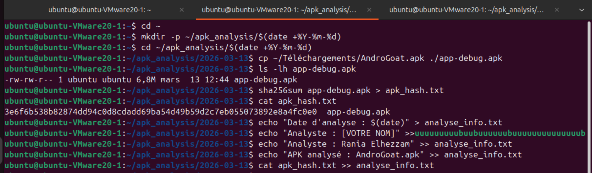
*Figure 1 : Création du dossier de travail et copie de l'APK*

| Information | Valeur |
|-------------|--------|
| **App Name** | AndroGoat - Insecure App (Kotlin) |
| **Package Name** | owasp.sat.agoat |
| **Main Activity** | owasp.sat.agoat.SplashActivity |
| **Target SDK** | 33 |
| **Min SDK** | 19 |
| **SHA256** | 3e6f6b538b82874dd94c0d8cdadd69ba54d49b59d2c7eb055073892e8a4fc0e0 |

---

## 4. LANCEMENT DE MobSF

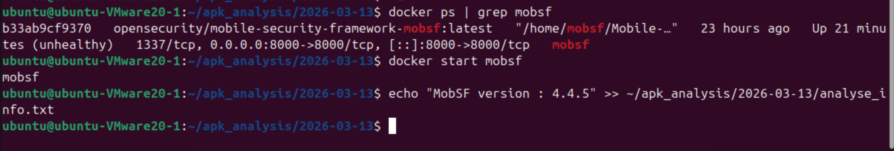
*Figure 4 : Vérification et démarrage du conteneur MobSF*

---

## 5. ANALYSE DE L'APK

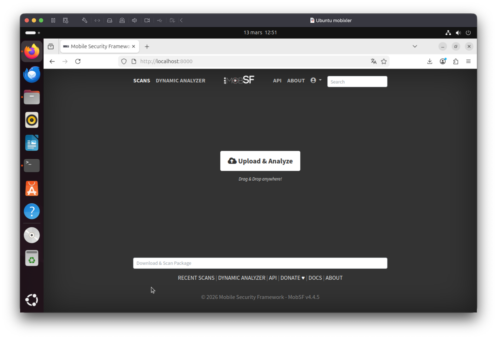
*Figure 5 : Upload de AndroGoat.apk dans MobSF*

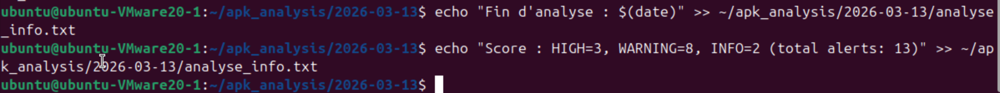
*Figure 6 : Enregistrement de la fin d'analyse*

**Score d'analyse :** HIGH=3, WARNING=8, INFO=2 (total alertes: 13)

---

## 6. ANALYSE DES PERMISSIONS

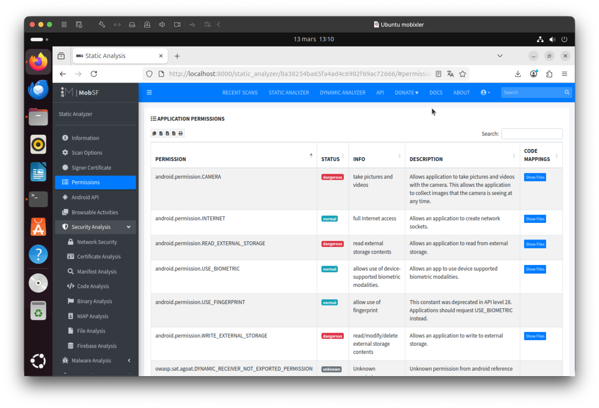
*Figure 7 : Liste des permissions demandées*

**Permissions dangereuses identifiées :**
- `android.permission.CAMERA` - Prendre des photos et vidéos
- `android.permission.READ_EXTERNAL_STORAGE` - Lire le stockage externe
- `android.permission.WRITE_EXTERNAL_STORAGE` - Écrire sur le stockage externe

**Permissions normales :**
- `android.permission.INTERNET`
- `android.permission.USE_BIOMETRIC`
- `android.permission.USE_FINGERPRINT` (déprécié)

**Permission personnalisée :**
- `owasp.sat.agoat.DYNAMIC_RECEIVER_NOT_EXPORTED_PERMISSION`

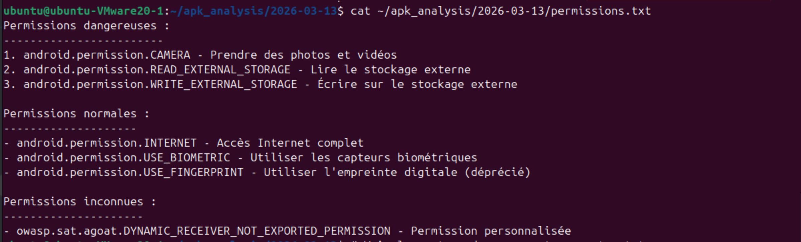
*Figure 8 : Liste documentée des permissions*

---

## 7. ANALYSE DU MANIFESTE

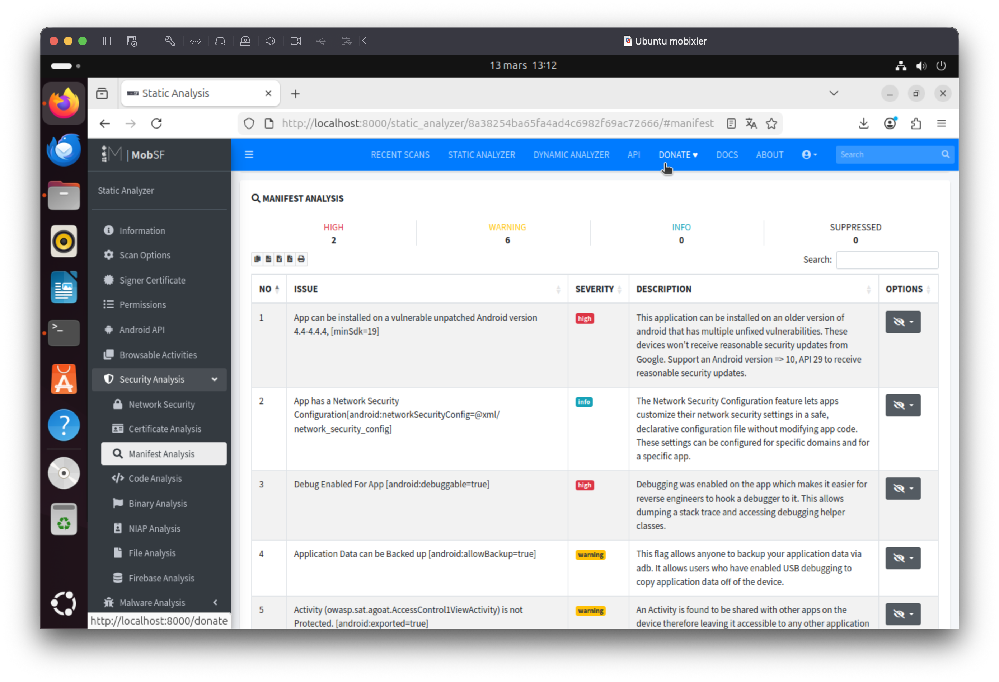
*Figure 9 : Analyse du manifeste Android*

**Alertes du manifeste :**

| N° | Problème | Sévérité |
|----|----------|----------|
| 1 | minSdk=19 (Android 4.4) - Version vulnérable | HIGH |
| 2 | Network Security Configuration présente | INFO |
| 3 | `android:debuggable=true` | HIGH |
| 4 | `android:allowBackup=true` | WARNING |
| 5 | Activité exportée non protégée | WARNING |

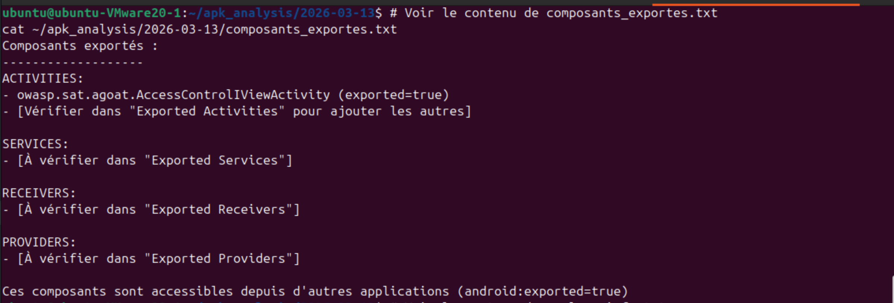
*Figure 10 : Composants exportés identifiés*

---

## 8. ANALYSE DE LA CONFIGURATION RÉSEAU

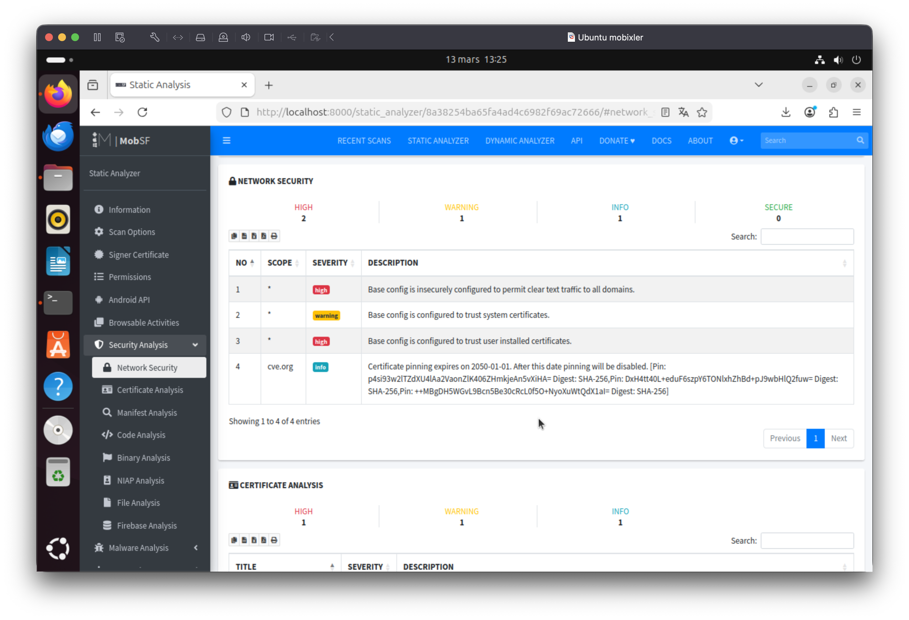
*Figure 11 : Analyse de la configuration réseau*

**Problèmes identifiés :**
- Trafic en clair autorisé vers tous les domaines (HIGH)
- Confiance aux certificats système (WARNING)
- Confiance aux certificats utilisateur (HIGH)
- Certificate pinning expire en 2050 (INFO)

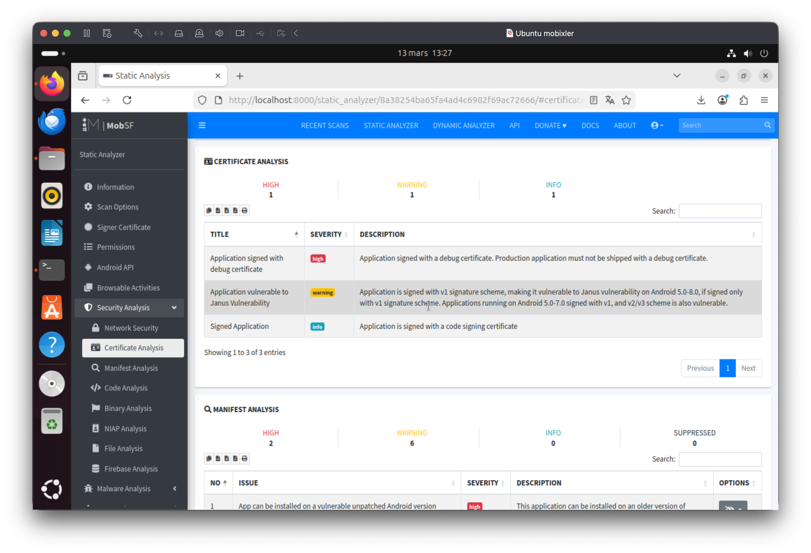
*Figure 12 : Analyse du certificat de signature*

**Problèmes de certificat :**
- Application signée avec certificat de debug (HIGH)
- Vulnérabilité Janus présente (WARNING)

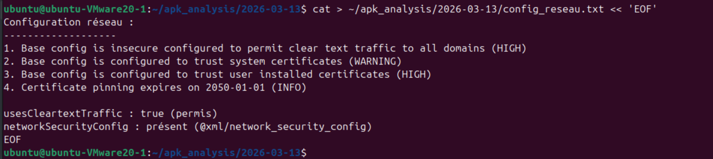
*Figure 13 : Configuration réseau documentée*

---

## 9. ANALYSE DU CODE

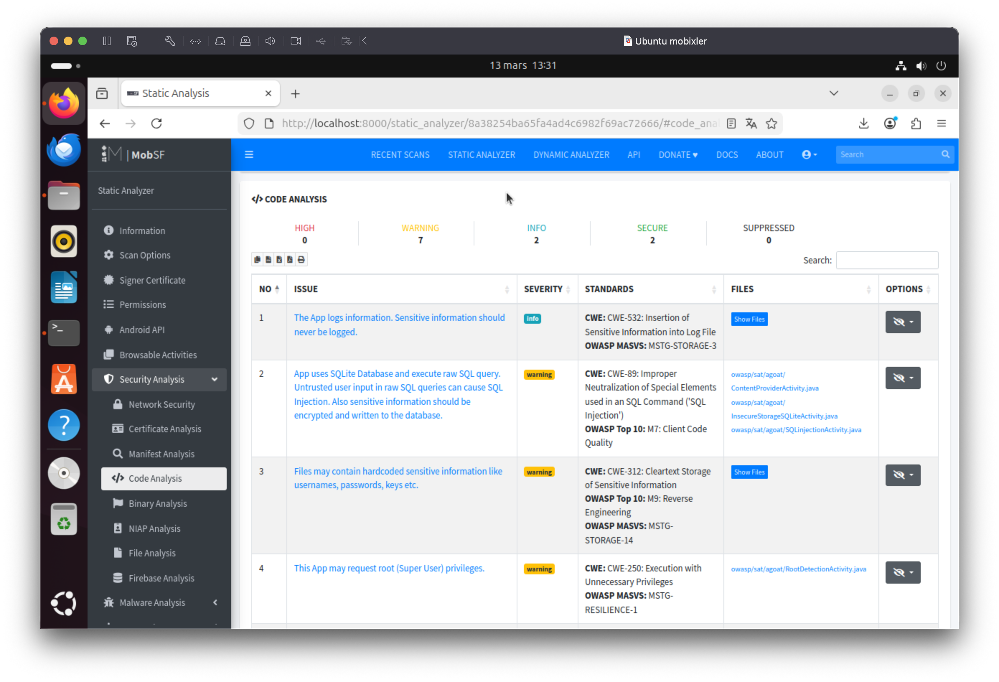
*Figure 14 : Vue d'ensemble de l'analyse de code*

**Alertes Code Analysis :**

| N° | Problème | Sévérité |
|----|----------|----------|
| 1 | Logs d'informations sensibles | INFO |
| 2 | SQL Injection potentielle | WARNING |
| 3 | Hardcoded secrets | WARNING |
| 4 | Root Detection | WARNING |

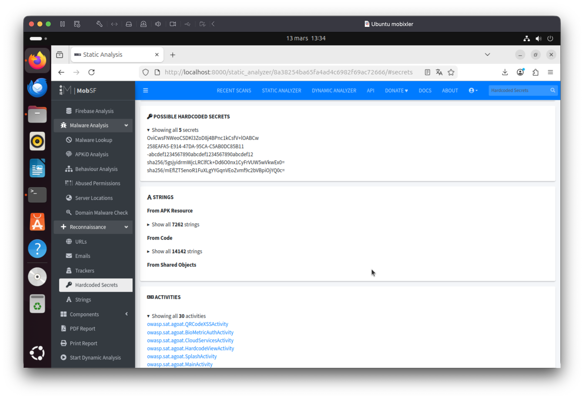
*Figure 15 : Secrets hardcodés identifiés (5 secrets)*

**Secrets identifiés :**
- `OviCwsFNWeoCSDKI32oD8j4BPnc1kCsfV+IOABCw`
- `258EAFA5-E914-47DA-95CA-C5AB0DC85B11`
- `abcdef1234567890abcdef1234567&spyidrmWjcRlCfck+Dd6O0nx1CyFrVUW5wVkwEx0=`
- `sha256/mfIztT5enoR1FuXLgYQqNVeOzvmf9c2bVBpiOiYQc0=`

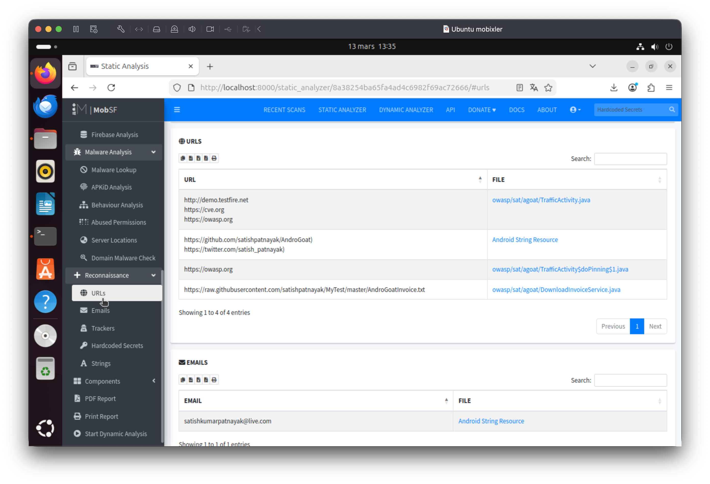
*Figure 16 : URLs et emails détectés*

**URLs identifiées :**
- `http://demo.testfire.net`
- `https://cve.org`
- `https://owasp.org`
- `https://github.com/satishpatnayak/AndroGoat`
- `https://twitter.com/satish_patnayak`

**Email identifié :**
- `satishkumarpatnayak@live.com`

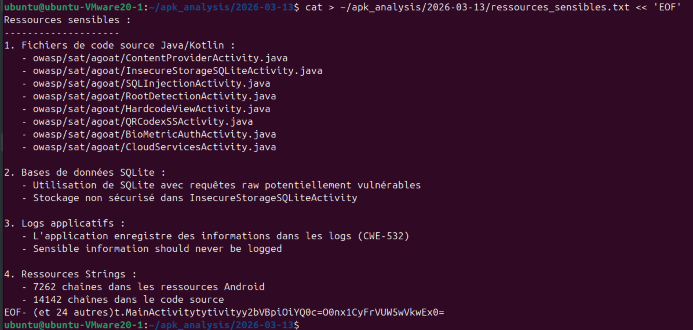
*Figure 17 : Ressources sensibles documentées*

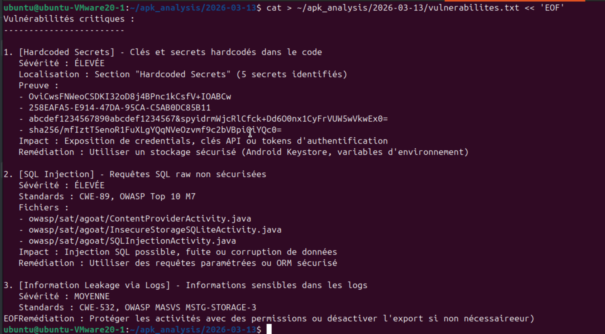
*Figure 18 : Vulnérabilités identifiées*

---

## 10. CORRÉLATION OWASP MASVS

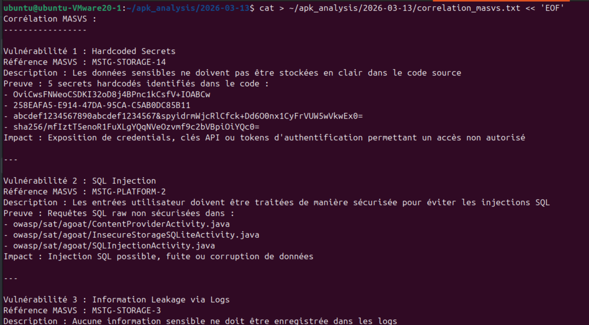
*Figure 19 : Corrélation avec OWASP MASVS (partie 1)*

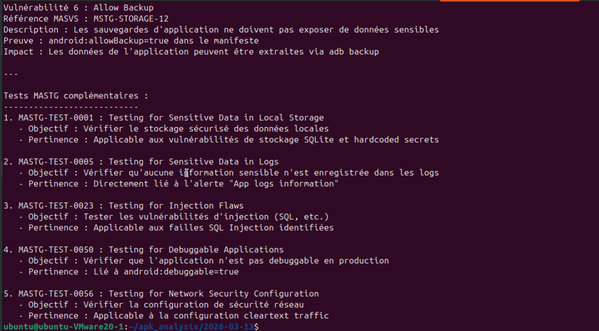
*Figure 20 : Corrélation avec OWASP MASVS (partie 2)*

**Correspondances établies :**
- Hardcoded Secrets → **MSTG-STORAGE-14**
- SQL Injection → **MSTG-PLATFORM-2**
- Information Leakage → **MSTG-STORAGE-3**
- Cleartext Traffic → **MSTG-NETWORK-2**
- Debuggable App → **MSTG-RESILIENCE-1**
- Allow Backup → **MSTG-STORAGE-12**

---

## 11. TOP 5 VULNÉRABILITÉS CRITIQUES

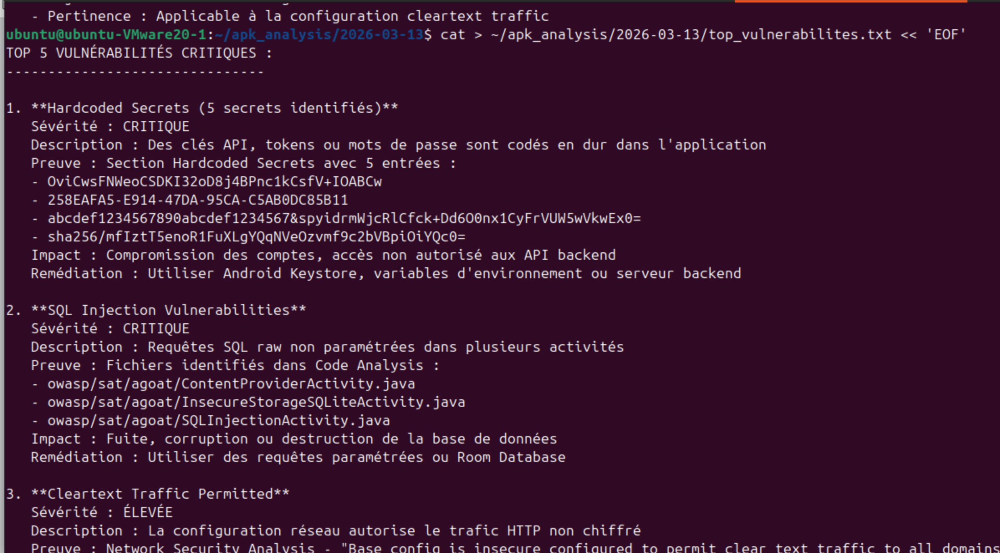
*Figure 21 : Top 5 des vulnérabilités critiques*

| Rang | Vulnérabilité | Sévérité |
|:----:|---------------|----------|
| **1** | Hardcoded Secrets (5 secrets) | CRITIQUE |
| **2** | SQL Injection | CRITIQUE |
| **3** | Cleartext Traffic Permitted | ÉLEVÉE |
| **4** | Debug Enabled | ÉLEVÉE |
| **5** | Exported Components (30+) | MOYENNE |

---

## 12. SYNTHÈSE DE L'ANALYSE

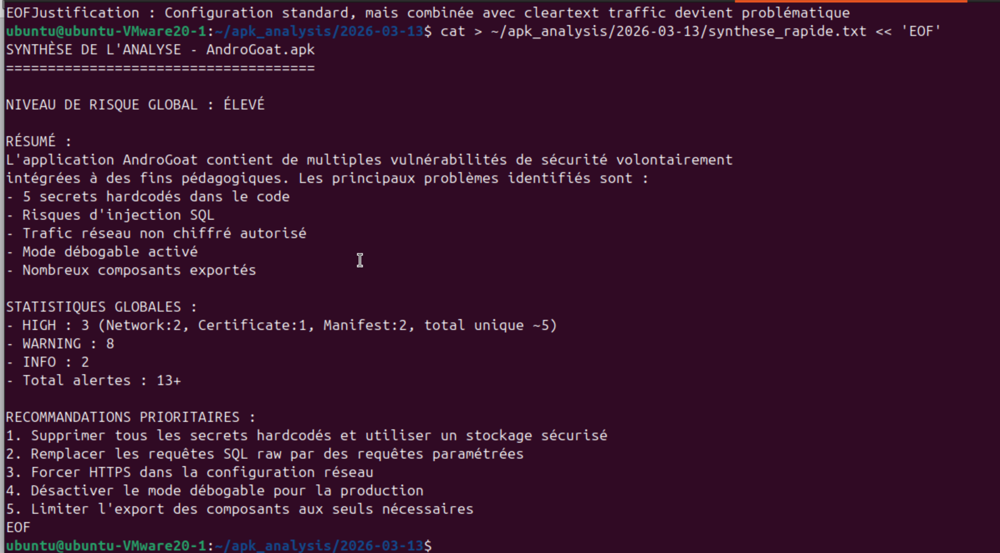
*Figure 22 : Synthèse rapide de l'analyse*

**Niveau de risque global : ÉLEVÉ**

**Résumé :**
L'application AndroGoat contient de multiples vulnérabilités de sécurité volontairement intégrées à des fins pédagogiques :
- 5 secrets hardcodés dans le code
- Risques d'injection SQL
- Trafic réseau non chiffré autorisé
- Mode débogable activé
- Nombreux composants exportés

---

## 13. EXPORTATION DU RAPPORT

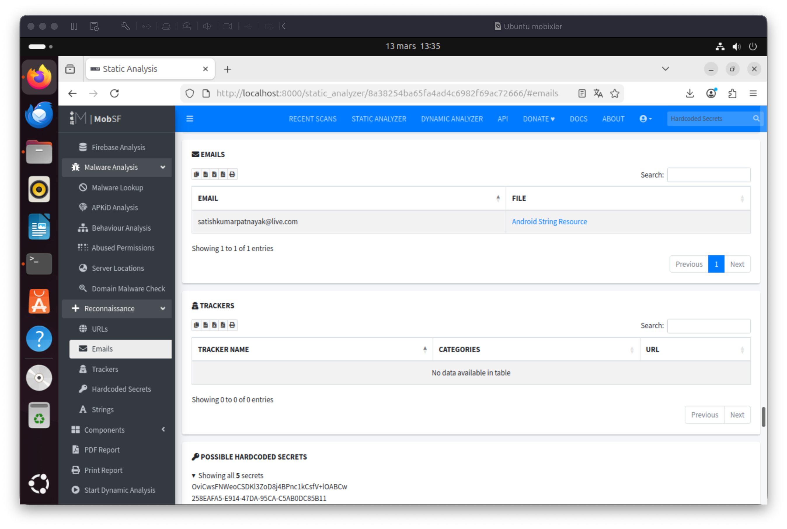
*Figure 23 : Bouton PDF Report dans l'interface MobSF*

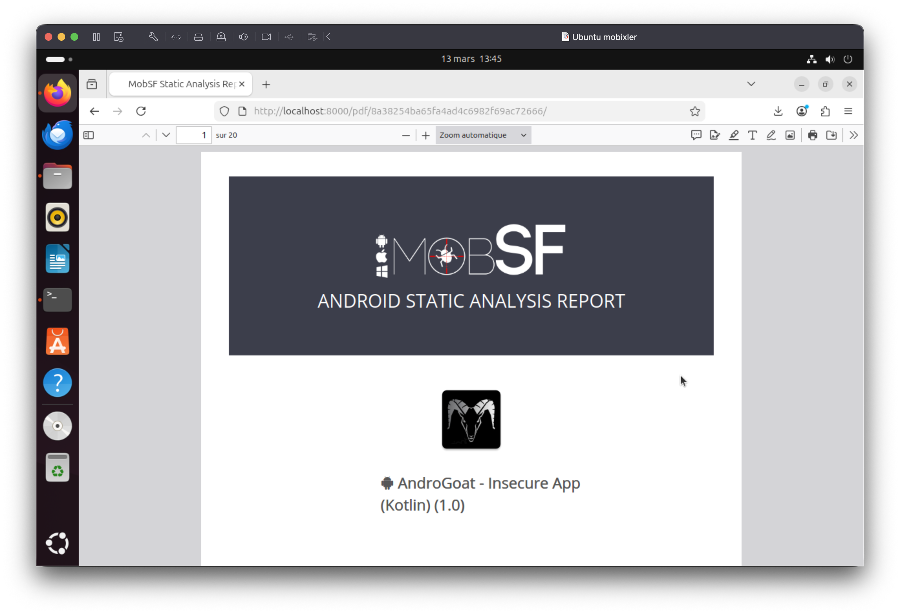
*Figure 24 : Rapport PDF généré par MobSF*

---

## 14. RECOMMANDATIONS PRIORITAIRES

1. **Supprimer tous les secrets hardcodés** et utiliser Android Keystore
2. **Remplacer les requêtes SQL raw** par des requêtes paramétrées
3. **Forcer HTTPS** dans la configuration réseau
4. **Désactiver le mode débogable** pour la production
5. **Limiter l'export des composants** aux seuls nécessaires

---

## 15. CONCLUSION

### 15.1 Compétences acquises

- Préparation d'un environnement d'analyse sécurisé
- Utilisation de MobSF pour l'analyse statique d'APK
- Interprétation des résultats (manifeste, permissions, code)
- Identification des vulnérabilités courantes
- Corrélation avec OWASP MASVS
- Priorisation des problèmes selon leur criticité
- Formulation de recommandations actionnables
- Production d'un rapport d'audit professionnel

### 15.2 Enseignements clés

- L'analyse statique automatisée doit être complétée par une expertise humaine
- Les secrets ne doivent jamais être stockés dans le code
- La configuration réseau doit forcer HTTPS en production
- Les composants exportés augmentent la surface d'attaque
- OWASP MASVS fournit un cadre structuré pour l'évaluation

---

**Rapport rédigé le :** 13 Mars 2026  
**Auteure :** Rania Elhezzam  
**Laboratoire :** LAB 6 - Analyse statique d'un APK avec MobSF
